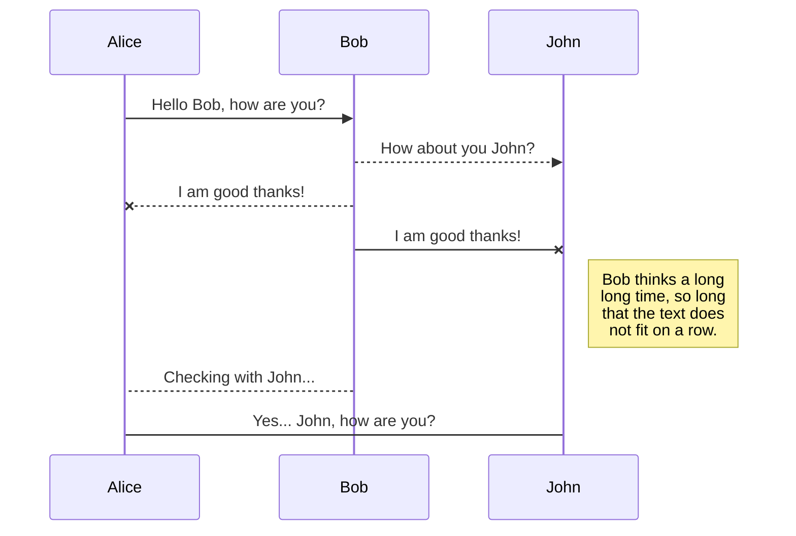

#service_name

This service allows users to...

## UML Diagram

[Mermaid](https://mermaidjs.github.io/)



## Requirements

Install the requirements:

```

```

## Install

For the latest stable version:

```

```

## API

**Method**|**Pattern**|**Handler**|**Action**
:-----:|:-----:|:-----:|:-----:
| | |


## Examples

```apib
# GET /message
+ Response 200 (text/plain)

        Hello World!
```

## Testing

### Unit tests

Make sure the dependencies are installed:

```

```

Run the unit tests

```

```

Run the unit tests with a local server that supports the application requirements. Ensure that you run the tests from the root directory.

### Local testing

Build and run locally:
```

```

Build and run Docker container locally and forward traffic to a local port:

```
docker build -t service_name .
docker run -t -p 8080:8080 service_name
```

Navigate to localhost:8080 within a browser to view the application.

Alternatively, submit a request to test for a response:

```
curl -X GET 'http://localhost:8080/
```
